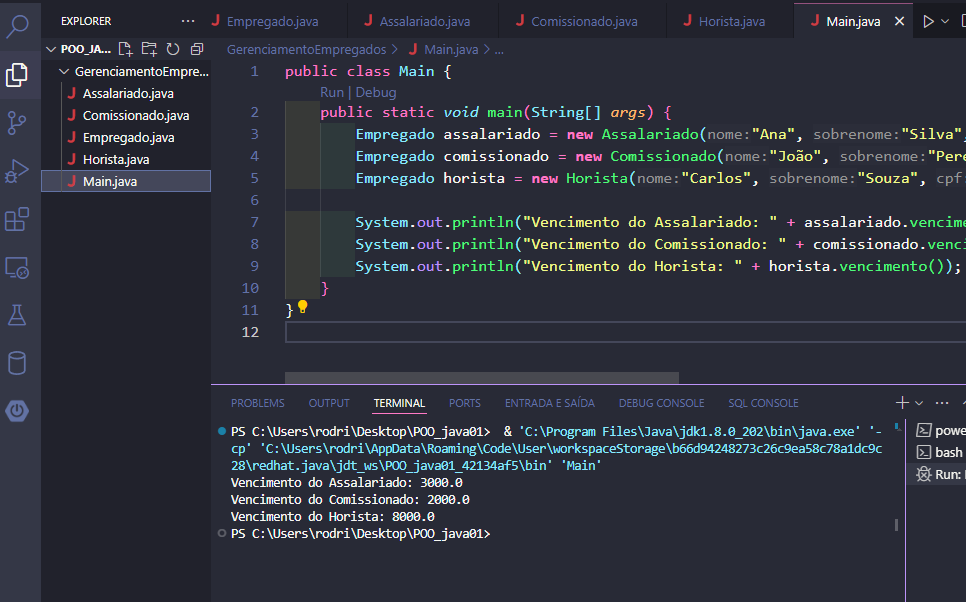

<!DOCTYPE html>
<html lang="pt-br">
<head>
    <meta charset="UTF-8">
    <meta name="viewport" content="width=device-width, initial-scale=1.0">
    <meta name="description" content="Gerenciamento de Empregados">
    <meta name="keywords" content="Java, POO, Empregados, Assalariado, Comissionado, Horista">
    <meta name="author" content="Ana Alice Rodrigues">

</head>
<body>

<header>
    <h1>Gerenciamento de Empregados</h1>
    
    
</header>

    
Índice

    <ol>
        <li><a href="#sobre-o-projeto">Sobre o projeto</a></li>
        <li><a href="#parte-tecnica">Parte Técnica</a></li>
        <li><a href="#estrutura-dos-arquivos">Estrutura dos Arquivos</a></li>
        <li><a href="#casos-de-uso">Casos de Uso</a></li>
        <li><a href="#ferramentas">Ferramentas</a></li>
        <li><a href="#contato">Contato</a></li>
    </ol>

<section id="sobre-o-projeto">
    <h2>Sobre o projeto</h2>
    

        O projeto "Gerenciamento de Empregados" é uma aplicação em Java que utiliza os princípios da Programação Orientada a Objetos (POO) para gerenciar informações de diferentes tipos de empregados: assalariados, comissionados e horistas. A aplicação permite calcular e exibir os vencimentos de cada tipo de empregado de acordo com suas características específicas.
    

    

        Proposta de Valor: Este programa pode ser utilizado por empresas para gerenciar e calcular os vencimentos de seus empregados de forma eficiente, considerando diferentes tipos de contratos de trabalho.
    

</section>

<section id="parte-tecnica">
    <h2>Parte Técnica</h2>
    <ul>
        <li><strong>Java:</strong> Linguagem de programação utilizada para desenvolver o programa.</li>
        <li><strong>Classes e Objetos:</strong> Utilização de classes para representar diferentes tipos de empregados.</li>
        <li><strong>Herança:</strong> Uso do conceito de herança para criar uma estrutura de classes que permite reutilização de código e organização lógica.</li>
        <li><strong>Abstração:</strong> Criação de uma classe abstrata para definir um template comum para as subclasses.</li>
        <li><strong>Polimorfismo:</strong> Implementação do método abstrato <code>vencimento</code> em cada subclasse para calcular o vencimento específico de cada tipo de empregado.</li>
    </ul>
</section>

<section id="estrutura-dos-arquivos">
    <h2>Estrutura dos Arquivos</h2>
    <ul>
        <li><code>Empregado.java</code>: Define a classe abstrata <strong>Empregado</strong> com propriedades comuns como nome, sobrenome e CPF, além de um método abstrato <code>vencimento()</code>.</li>
        <li><code>Assalariado.java</code>: Estende a classe <strong>Empregado</strong> e adiciona a propriedade específica <code>salario</code>. Implementa o método <code>vencimento()</code> para retornar o salário.</li>
        <li><code>Comissionado.java</code>: Estende a classe <strong>Empregado</strong> e adiciona as propriedades específicas <code>totalVenda</code> e <code>taxaComissao</code>. Implementa o método <code>vencimento()</code> para calcular a comissão com base nas vendas.</li>
        <li><code>Horista.java</code>: Estende a classe <strong>Empregado</strong> e adiciona as propriedades específicas <code>precoHora</code> e <code>horasTrabalhadas</code>. Implementa o método <code>vencimento()</code> para calcular o vencimento com base nas horas trabalhadas.</li>
        <li><code>Main.java</code>: Contém o método <code>main</code> que instancia objetos das classes <strong>Assalariado</strong>, <strong>Comissionado</strong> e <strong>Horista</strong>, e chama o método <code>vencimento()</code> para exibir as informações.</li>
    </ul>

</section>

<section id="casos-de-uso">
    <h2>Casos de Uso</h2>
    <ul>
        <li>Gerenciamento de folhas de pagamento em empresas.</li>
        <li>Cálculo de vencimentos para diferentes tipos de contratos de trabalho.</li>
        <li>Organização e categorização de empregados de acordo com o tipo de remuneração.</li>
    </ul>
</section>

<section id="ferramentas">
    <h2>Ferramentas</h2>
    <ul>
        <li></li>
        <li></li>
        <li></li>
    </ul>
</section>

<section id="contato">
    <h2>Contato</h2>
    <ul>
        <li></li>
    </ul>
</section>

</body>
</html>
